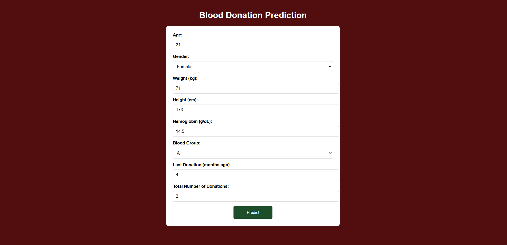
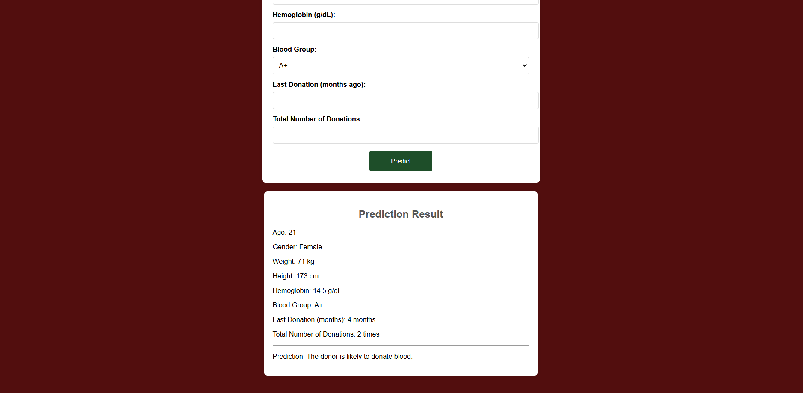
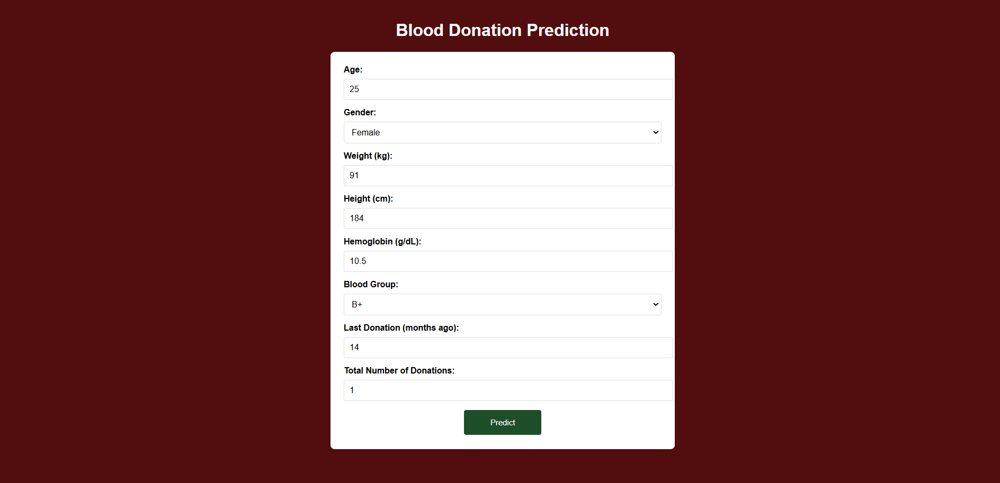
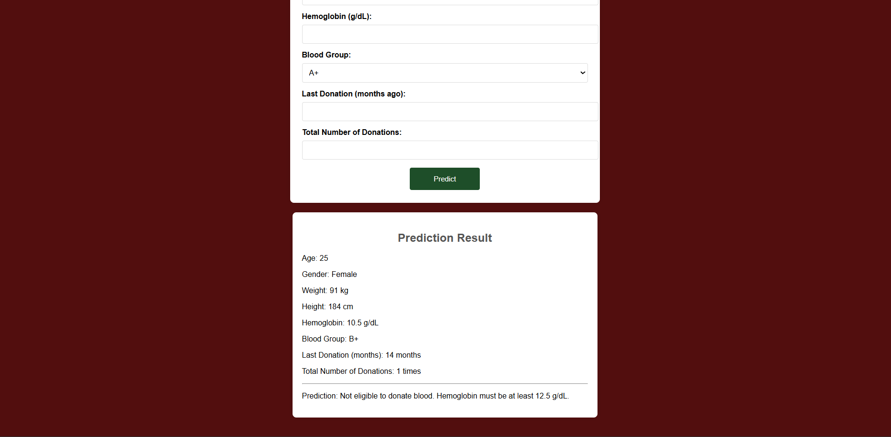

# 🩸 Blood Donation Prediction using Machine Learning

This project predicts whether a person is eligible to donate blood based on demographic and medical input using a trained Random Forest model. It features a simple web interface built using Flask, where users input their details and receive a prediction along with the reason.

---

## 📷 App Preview

**Prediction: Eligible**
<br>  



**Prediction: Not Eligible**
<br>  



> 📌 The app checks conditions such as age, weight, hemoglobin, and last donation interval before using the machine learning model.

---

## 🔍 Project Overview

The project helps in automating the screening process for blood donation. It collects the user’s input, checks minimum health criteria (like hemoglobin ≥ 12.5 g/dL), and then uses a trained Random Forest classifier to predict eligibility.

- Built using Python and Flask
- Trained on a dataset of 2000+ donor records
- Interactive web form for easy prediction
- Useful for pre-screening potential blood donors

---

## 🧠 Machine Learning Details

- **Algorithm**: Random Forest Classifier
- **Accuracy**: 90.27%
- **Precision**: 90.68%
- **Recall**: 79.26%
- **Training Data**: 2001 samples
- **Input Features**:
  - Age
  - Gender
  - Weight
  - Height
  - Hemoglobin (g/dL)
  - Blood Group
  - Last Donation (months)
  - Total Number of Donations
- **Preprocessing**: Encoding + Standard Scaling

---

## 🚀 How to Run the Project

### Step 1: Set Up Environment

```bash
python -m venv venv
# On Windows
venv\Scripts\activate
# On Mac/Linux
source venv/bin/activate
```

### Step 2: Install Required Libraries

```bash
pip install -r requirements.txt
```

### Step 3: Run the App

```bash
python app.py
```
### Step 4: Visit the App

## Once the app is running, open your browser and go to:
```bash
http://127.0.0.1:5000
```

## ⚙️ Features

- ✔️ Intuitive web UI
- 🧪 Medical rules applied before ML (age, weight, hemoglobin)
- 🔮 Prediction using trained model
- 💬 Feedback with reason for eligibility or ineligibility
- 📦 Includes source code, dataset, model, and web interface

## 📜 License

This project is protected by a custom license.  
You are free to use it for personal or educational purposes only.  
**Rebranding, redistribution, or commercial use is strictly prohibited without written permission.**  
See [LICENSE](LICENSE) for full details.
